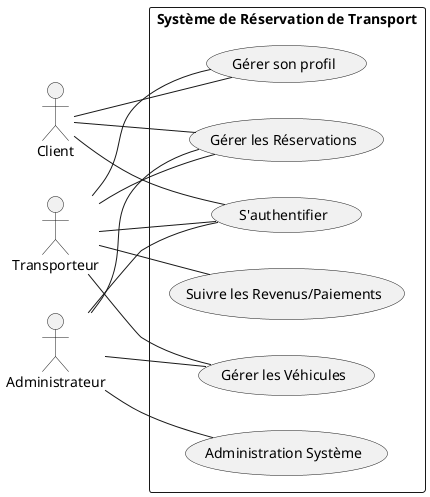
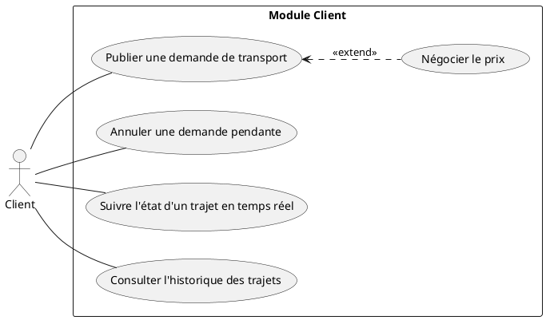
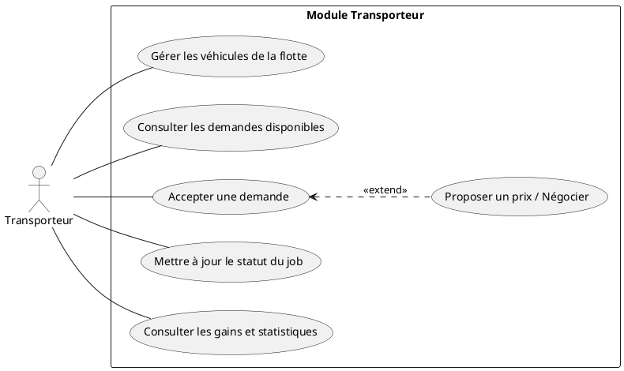
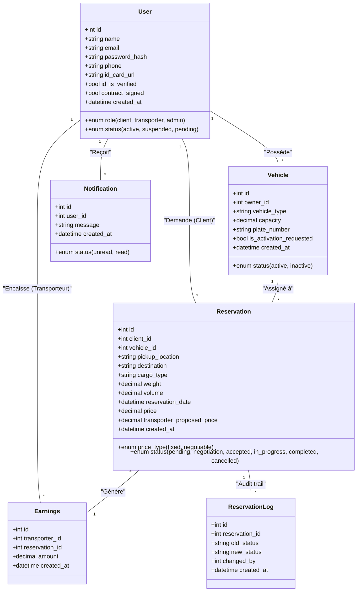
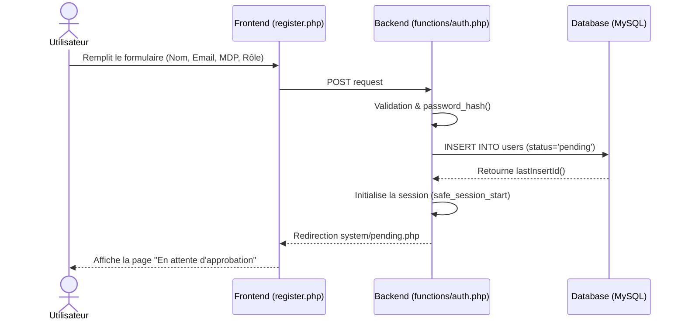
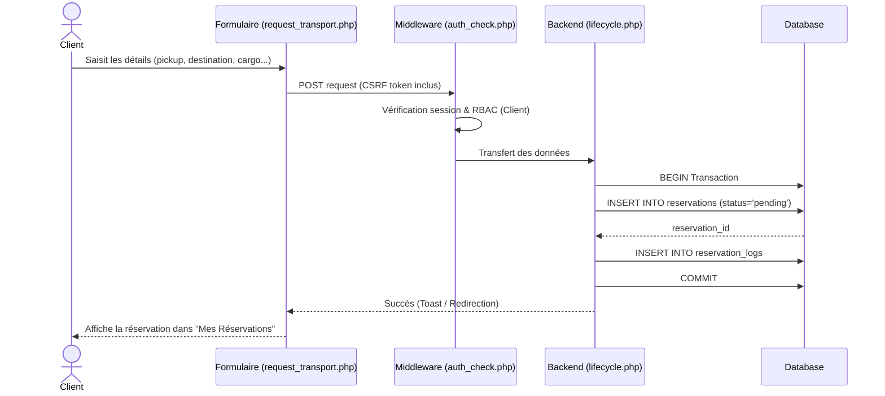
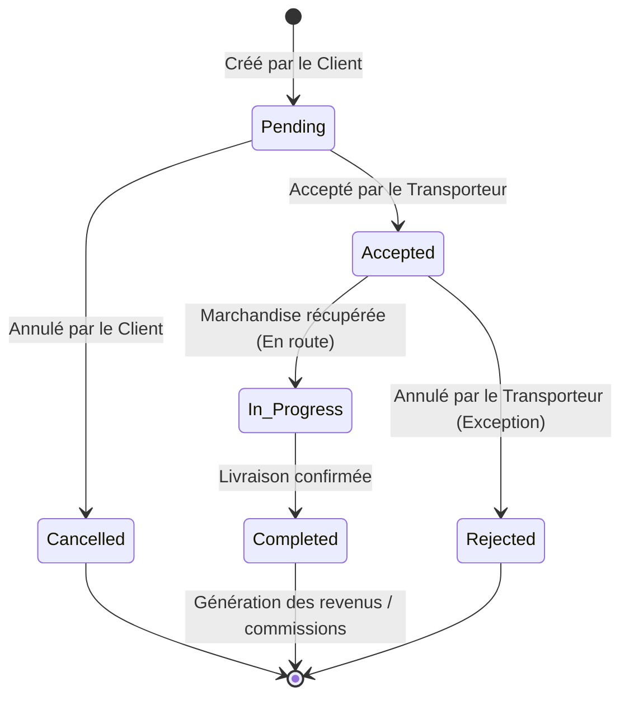
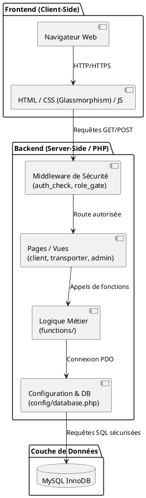
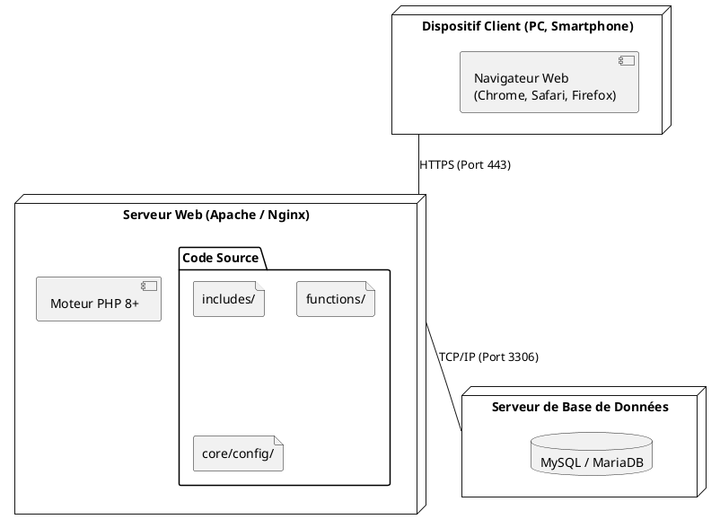

# Chapitre 3 — Analyse et Conception du Système (UML)

Ce document présente l'architecture logicielle, la conception de la base de données et la modélisation UML de la plateforme de réservation de transport. Il est conçu pour s'intégrer directement dans la documentation technique ou le rapport de PFE (Projet de Fin d'Études).

## 3.1 Diagramme de Cas d'Utilisation (Use Case Diagram)

Le diagramme des cas d'utilisation modélise les interactions entre les acteurs (Client, Transporteur, Administrateur) et le système.

**Acteurs identifiés :**
- **Client (Expéditeur)** : Utilisateur souhaitant faire transporter une cargaison.
- **Transporteur (Chauffeur)** : Professionnel possédant des véhicules et proposant ses services.
- **Administrateur** : Superviseur de la plateforme garantissant le bon fonctionnement et gérant les commissions.

### 3.1.1 Diagramme Général des Cas d'Utilisation
Ce diagramme offre une vue d'ensemble des interactions entre les acteurs et les grands blocs fonctionnels du système.



### 3.1.2 Cas d'Utilisation - Client
Focus sur les fonctionnalités dédiées à l'expéditeur.



### 3.1.3 Cas d'Utilisation - Transporteur
Focus sur la gestion de la flotte et des missions.



### 3.1.4 Cas d'Utilisation - Administrateur
Focus sur la modération et l'audit.

```plantuml
@startuml
left to right direction
actor "Administrateur" as A

rectangle "Module Administration" {
  (Vérifier et Valider les comptes) as UC1
  (Approuver / Désactiver des véhicules) as UC2
  (Surveiller les flux de réservations) as UC3
  (Consulter les journaux d'audit (Logs)) as UC4
  (Gérer les commissions) as UC5
  (Gérer les litiges) as UC6
  
  A -- UC1
  A -- UC2
  A -- UC3
  A -- UC4
  A -- UC5
}
@enduml
```

---

## 3.2 Diagramme de Classes (Class Diagram)

Ce diagramme illustre la structure des données du système, en correspondance avec la base de données relationnelle (MySQL InnoDB). Il met en évidence les entités principales et leurs relations.



---

## 3.3 Diagrammes de Séquence (Sequence Diagrams)

### 3.3.1 Inscription d'un Utilisateur
Le processus d'inscription montre comment les données sont sécurisées, hachées, puis insérées dans la base de données avant la redirection vers la page d'attente.



### 3.3.2 Création d'une Demande de Transport
Détaille les interactions de sécurité (Middleware) et la transaction lors de l'enregistrement d'une demande par un client.



### 3.3.3 Acceptation d'une Demande par le Transporteur
Ce diagramme est critique, car il inclut la gestion de la concurrence (`SELECT ... FOR UPDATE`) empêchant deux transporteurs d'accepter la même mission.

```mermaid
sequenceDiagram
    actor T as Transporteur
    participant UI as Dashboard (requests.php)
    participant B as Backend (lifecycle.php)
    participant DB as Database

    T->>UI: Clique sur "Accepter la demande"
    UI->>B: POST action=accept, reservation_id, vehicle_id
    B->>DB: BEGIN Transaction
    B->>DB: SELECT status FROM reservations WHERE id=? FOR UPDATE
    DB-->>B: status == 'pending'
    B->>DB: UPDATE reservations SET vehicle_id=?, status='accepted'
    B->>DB: INSERT INTO reservation_logs
    B->>DB: INSERT INTO notifications (Notify Client)
    B->>DB: COMMIT
    B-->>UI: Retour succès
    UI-->>T: Met à jour l'interface utilisateur

### 3.3.4 Processus de Négociation du Prix
Montre l'échange entre le transporteur (proposition) et le client (acceptation).

```mermaid
sequenceDiagram
    actor T as Transporteur
    actor C as Client
    participant B as Backend (lifecycle.php)
    participant DB as Databasess

    T->>B: Propose un nouveau prix (negotiated_price)
    B->>DB: UPDATE status='negotiation', transporter_proposed_price=?
    B->>DB: INSERT INTO reservation_logs
    B->>DB: INSERT INTO notifications (Pour le Client)
    DB-->>C: Notification: "Nouvelle offre reçue"
    
    C->>B: Accepte l'offre du transporteur
    B->>DB: UPDATE status='accepted', price=transporter_proposed_price
    B->>DB: INSERT INTO reservation_logs
    B->>DB: COMMIT
    B-->>C: Succès
```
```

---

## 3.4 Diagramme d'Activité (Activity Diagram)

Ce diagramme représente le cycle de vie métier d'une réservation, depuis sa création jusqu'à sa finalisation, en respectant les états stricts définis dans la base de données.



---

## 3.5 Diagramme de Composants (Component Diagram)

Ce diagramme montre l'architecture modulaire du projet, en séparant la présentation de la logique métier et des données.



---

## 3.6 Diagramme de Déploiement (Deployment Diagram)

Ce diagramme modélise l'architecture physique ou virtuelle du système une fois mis en production, indiquant les protocoles de communication.



---
*Ce document respecte fidèlement les implémentations et les choix technologiques du projet (PHP, PDO, requêtes préparées, transactions SQL, RBAC).*
